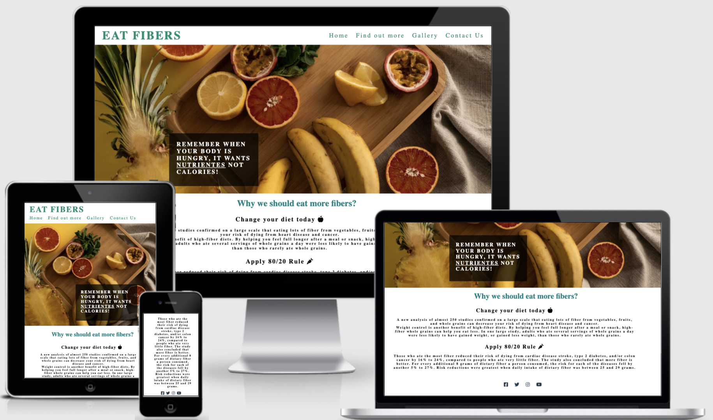
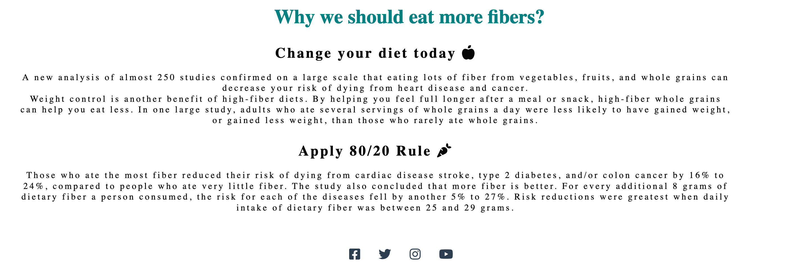
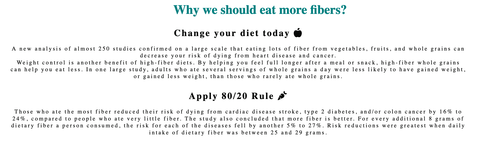
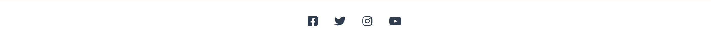
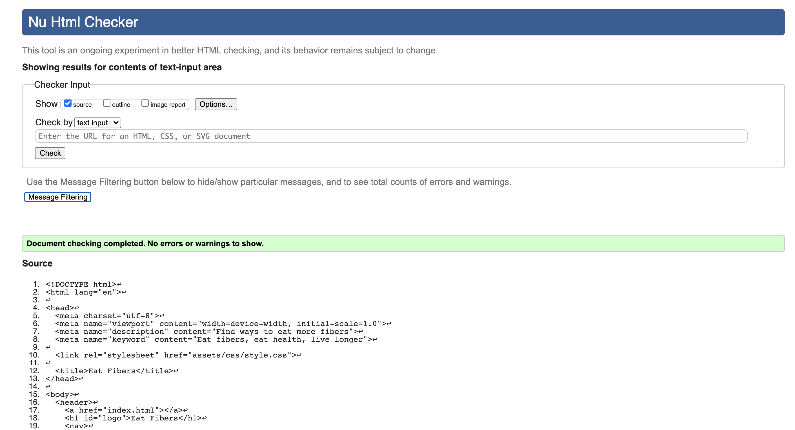
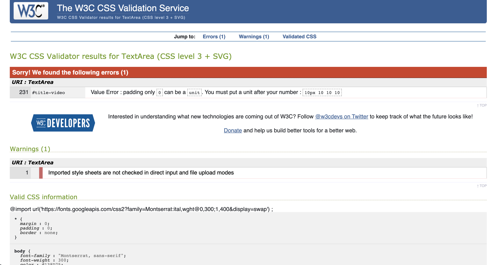
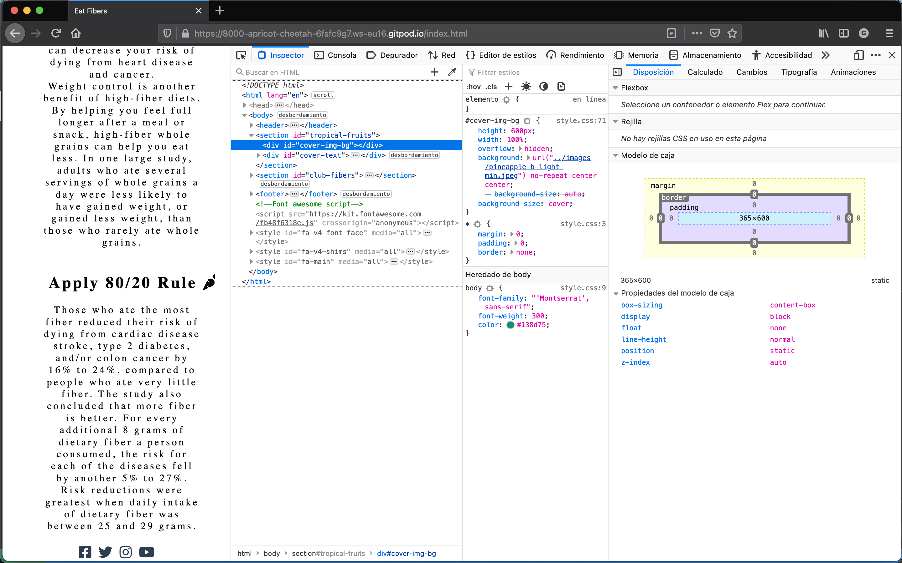
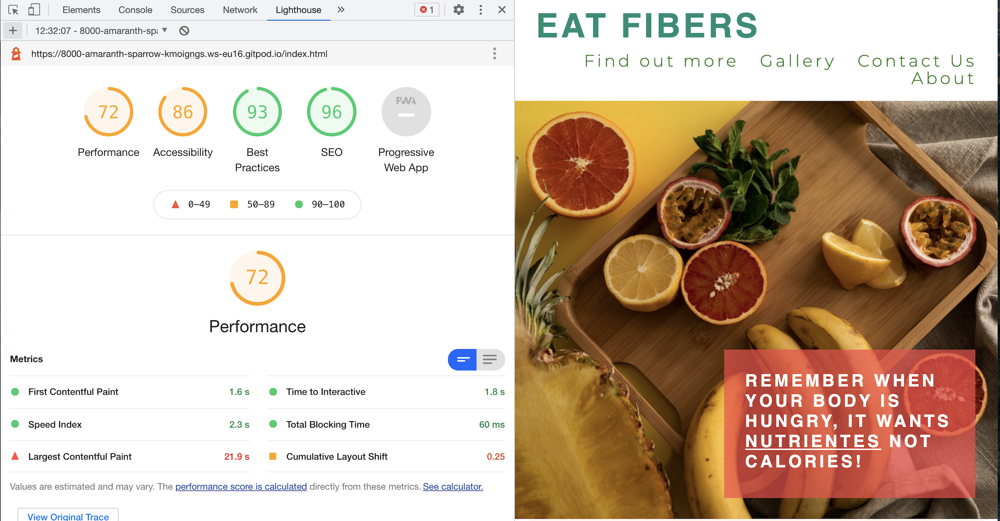
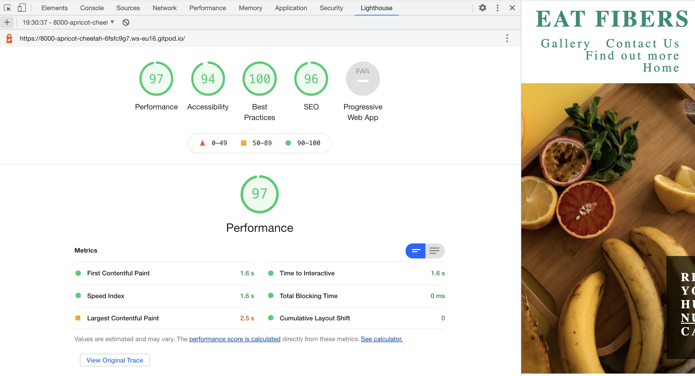

# EAT FIBERS
https://gleidecn.github.io/eat-fibers-My-own-project/index.html

#### Eat fibers is a site that wants to encourage people to consume more fibers in their day-to-day diet.

 

   

## FEATURES

- Navigation Bar

    - Featured on all four pages, the full responsive navigation bar includes links to the Logo, About page, Find Out more, Gallery and Contact Us page and is identical in each page to allow for easy navigation.
    - This section will allow the user to easily navigate from page to page across all devices without having to revert back to the previous page via the ‘back’ button.

 ### The landing page image

    - The landing includes a photograph with text overlay to allow the user to see what is this site about.
    - The reason I´ve chosen this image is because it is eye-catching.
    - I also add a text box on the left hand side of the image to be more dramatic.

   
   

### Club Fibers Section

   - The club fibers section will allow the user to have some information about why is so important to consume fibers every single day.

   

## Footer

    - The footer section includes links to the relevant social media sites for Eat Fibers. The links will open to a new tab to allow easy navigation for the user.    
    - The footer is valuable to the user as it encourages them to keep connected via social media.

  

## Find Out More Section

    - In this section, the user will see a short video explaining what is fibers, and where they can get from. 
    - I've added the video because I want the site to be more interactive with the audience and also because I want them to spend more time on the page as well.

 ## Gallery Section

    - The gallery will provide the user with some ideas of what they could eat and drink on a daily basis.

 ## Contac Us Section

    - This page will allow the user to get in touch with us in case they have any questions related to fibers.

 ## Features Left to Implement

    - I want to improve the Club-Fibers Section, I need to improve the format of the text.
    - I want to add some pictures behind the section box-text-one and box-text-two.
    - I want to format the gallery section and make a perfect square at the bottom of the section.
    - I need to improve the Contact section I need the to page be adjusted in one square, like the Find Out More section.

 ## TESTING

    - I´ve run the website on the differents web browsers, such as Google, Safari and Firefox.
    - I´ve notice the Firefox has a better image quality compare to the others.

        - Firefox

        - Chrome

        - Safari
 

    - Running the code on The W3C CSS Validation Service I was able to spot few erros:
    - Family names containing whitespace should be quoted. If quoting is omitted, any whitespace characters before and after the name are ignored and any sequence of whitespace characters inside the name is converted to a single space. 

   
    - I´ve also notice this erros:
    - Imported style sheets are not checked in direct input and file upload modes.

    - So I've researched on [https://www.py4u.net/discuss/1074517] and founded this answer:
    - You're just trying to validate your CSS file using the W3C validator, and it's letting you know that it's not going to validate the imported style sheet (Google's). It's not an error, just some information for you.

    - I´ve also testes on the mobile size and the code is responsive:

    - I´ve used the DevTools and the Lighthouse report to achieve the results:

#### Before any change on the web site:

#### After few changes:

    - After applying some rules on good accessibility, performance, and decreasing the size of the images I was able to achieve good metrics on the Lighthouse tool.

    
## Unfixed Bugs

    - The gallery I need to improve the bottom of the all images.
    - I need to improve the bottom of the video section.
    - The contact section has to be just one in a better size or to big.

## Deployment

#### I've found very interesting the process of doing the deployment, very useful and helpful as well. I think it was great having the chance to expose my projects and my live website.

    - The site was deployed to GitHub pages. The steps to deploy are as follows:
        - In the GitHub repository, navigate to the Settings tab
        - From the source section drop-down menu, select the Master Branch
        - Once the master branch has been selected, the page will be automatically refreshed with a detailed ribbon display to indicate the successful deployment.
    
- The link for my live project can be found here [Github](https://gleidecn.github.io/eat-fibers/)

## Credits    

#### Links:

- Quote from cover text on the landing page was from [Pinterest](https://www.pinterest.co.uk/pin/AULzf4aIXkqkba3H0geTUaY6IgSlPagTTxdvcmdNemCGtvbb8Lr3L5U/)

- The Club Fibers text was from [Harvard the nutrition source](https://www.hsph.harvard.edu/nutritionsource/carbohydrates/fiber/)

    
### Media:

- [Unsplash](https://unsplash.com) 
    - creators:

            - [Nathan Dumlao]
            - [Vitalii Pavlyshynets]
            - [Edgar Castrejon]
            - [Giorgi Iremadze]
            - [Milada Vigerova]
            - [Artur Rutkowski]
            - [Priyanka Singh]
            - [Ana Azevedo]
            - [Nadine Primeau]
            - [Brooke Lark]
            - [Vitalii Pavlyshynets]

#### Media

    - The photos used on the home, gallery, and sign up page were taken from an Open Source site:
        - (https://unsplash.com)

##### Content

    - The quote from landing page was taken from Pinterast post.
    - The main text was from Harvard the nutrition source.
    - Instructions on how to implement video section: You Tube: Med Today.
    - The icons in the club-fibres section, the footer and the contact us section were taken from Font Awesome.

#### Video:

- Med Today - Foods Rich In Fiber [You Tube](https://www.youtube.com/watch?v=z6KeGsQQGt0)

